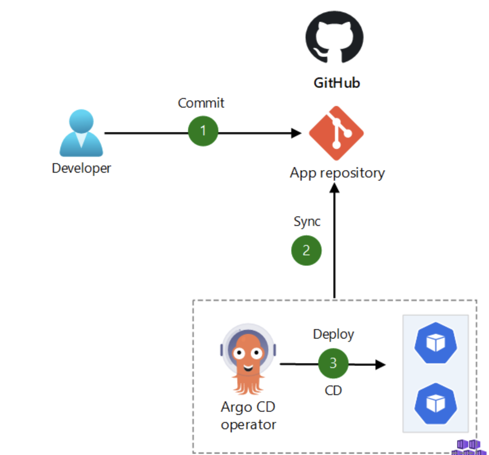
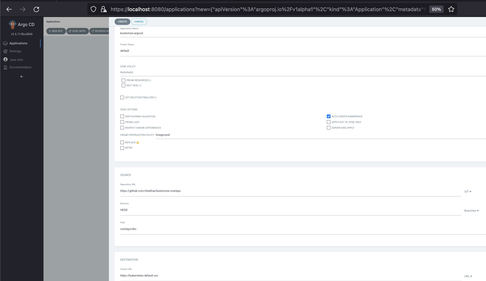
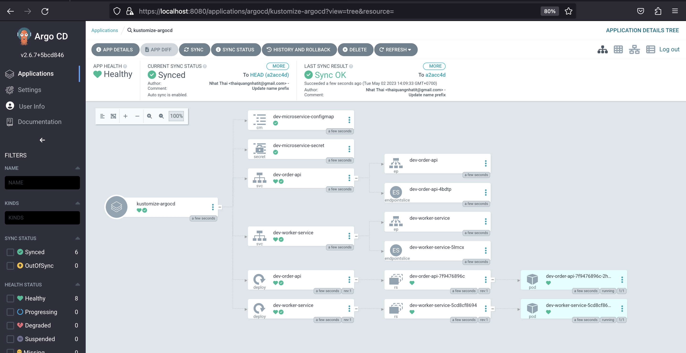

# Kustomize Overlays
    Example: create overlays for each environment using Kustomize
    Deploy order api and worker service on Minikube using Kustomize
    Deploy order api and worker service with ArgoCD(GitOps)

### Prerequisites
    + Install Minikube
    + Install Kustomize



### Usage
+ Build Base
    ```
    kustomize build .\base
    ```

+ Preview output in Dev
    ```
    kustomize build overlays/dev
    ```

+ Apply/Deploy output in Dev
    ```
    kustomize build overlays/dev | kubectl apply -f -
    ```

### Using ArgoCD(GitOps)
Argo CD - Declarative GitOps CD for Kubernetes
+ Install ArgoCD
    ```
    kubectl create namespace argocd
    kubectl apply -n argocd -f https://raw.githubusercontent.com/argoproj/argo-cd/stable/manifests/install.yaml
    ```
+ Download Argo CLI on Mac/Linux
    ```
    brew install argocd
    ```
+ Forward Port ArgoCD
    ```
    kubectl port-forward svc/argocd-server -n argocd 8080:443
    ```
+ Generate password(username: admin)
    ```
    argocd admin initial-password -n argocd
    ```

+ Create app
        

+ Detail app
     
